# FinSlice  

FinSlice is a modern **personal finance management app**, inspired by the book *Rich Dad Poor Dad*.  
Built with **Jetpack Compose** and **Material Design 3**, it delivers a clean, smooth, and scalable experience.  
The app integrates **Firebase Authentication**, **Firestore**, and follows the **MVVM architecture** with **Hilt Dependency Injection** for maintainability and real-time performance.  

---

## ✨ Features  

- 🎨 **Modern Jetpack Compose UI** with Material Design 3  
- 🔑 **Secure Firebase Authentication**  
  - Email & Password  
  - Google Sign-In  
- ☁️ **Realtime Firestore Integration** using **Kotlin Flow & Coroutines**  
- 🏗 **MVVM Architecture + Hilt DI** for scalability and clean architecture  
- 🌓 **Light / Dark Mode** support  
- 🎛 **Dynamic Theme Mode** for seamless UI adaptation  
- 📊 **Pie Graph Visualization** of financial data  

---

## 📸 Screenshots  


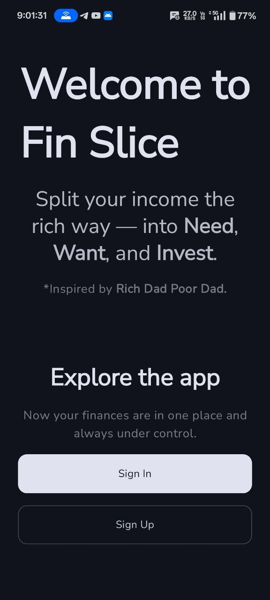  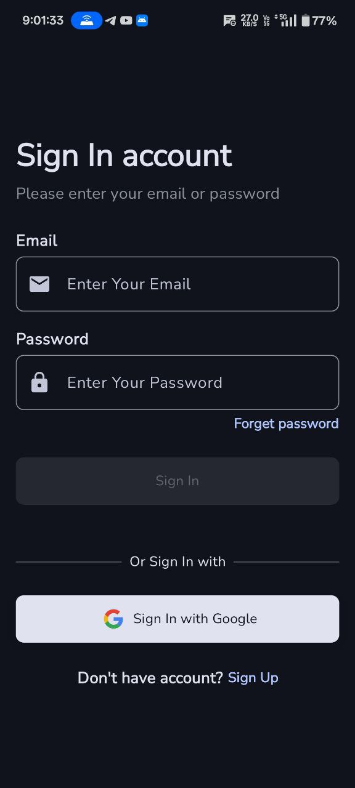  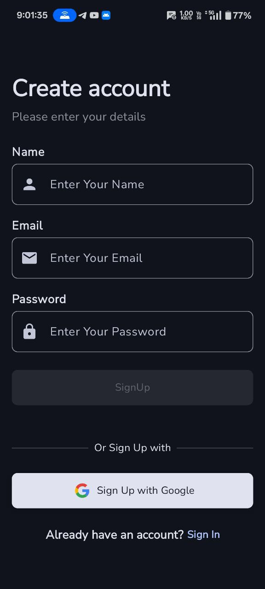 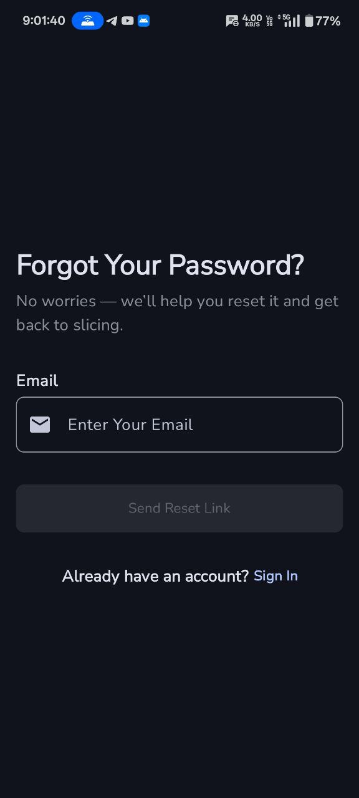 
 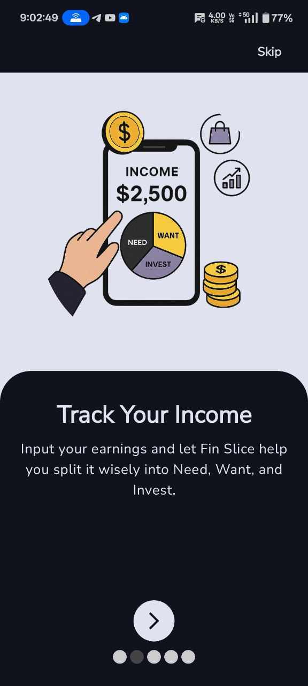 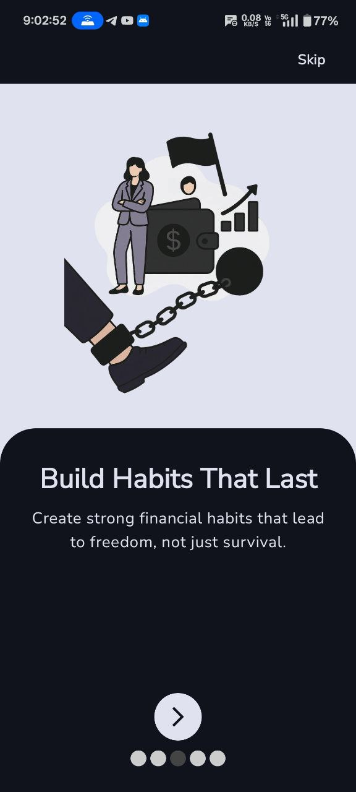 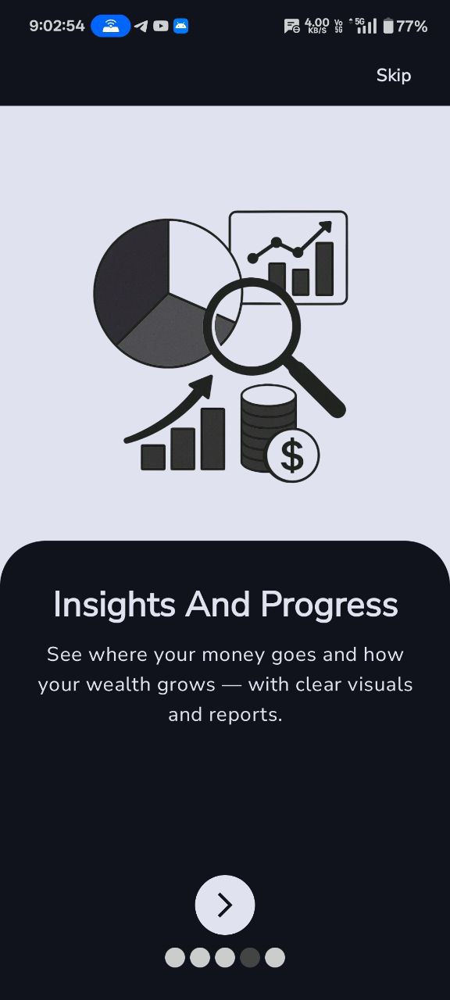 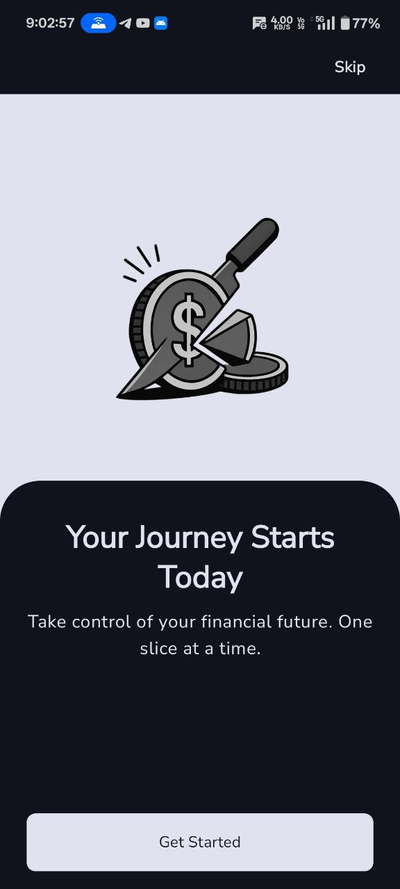 

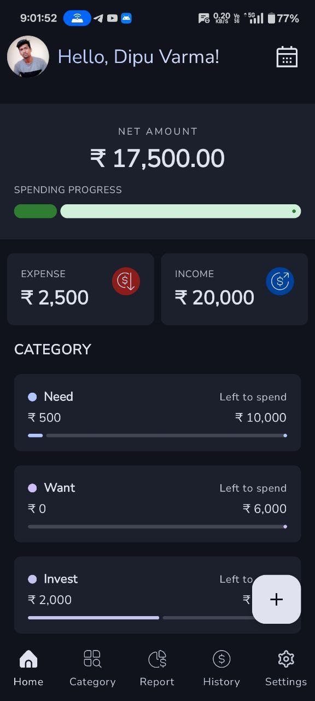 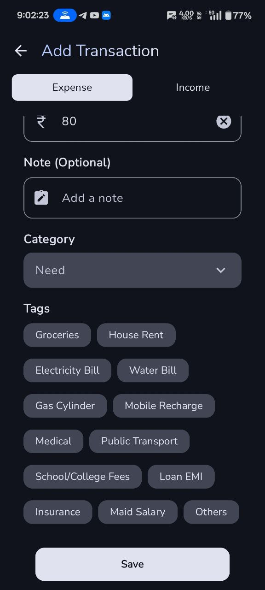 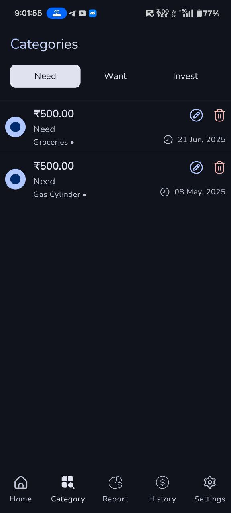 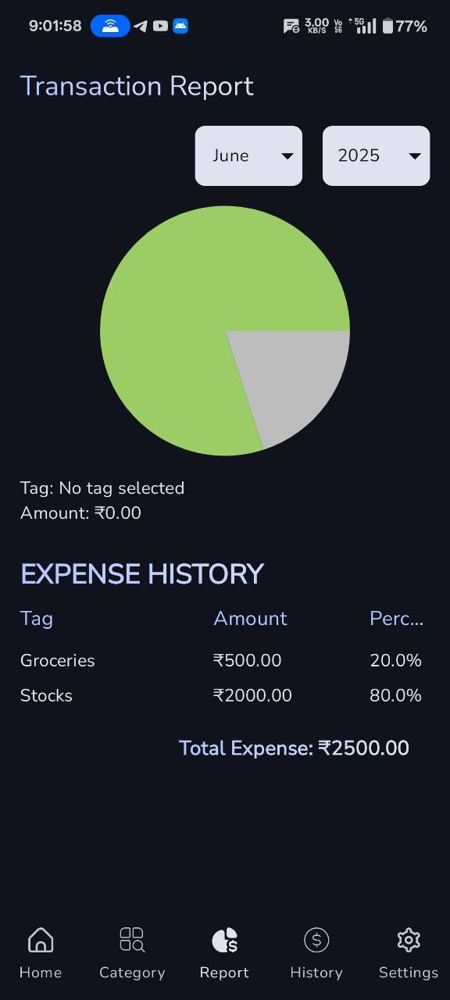 
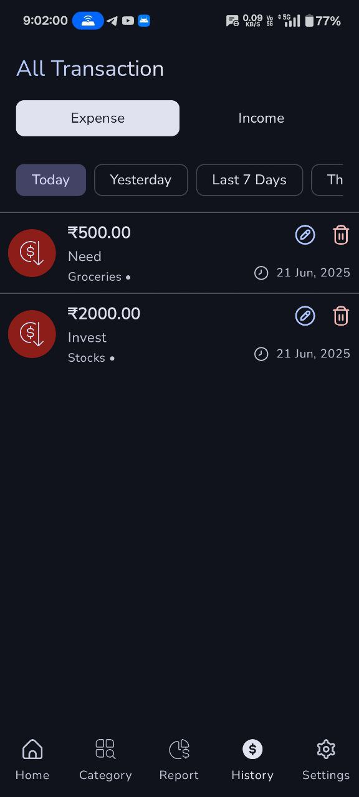 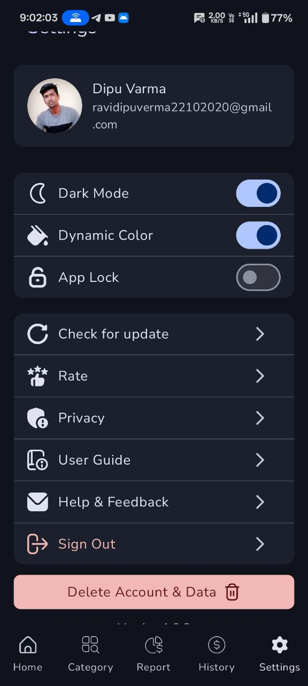 

---

## 🛠 Tech Stack  

- **UI**: Jetpack Compose, Material Design 3  
- **Architecture**: MVVM + Hilt (Dependency Injection)  
- **Database**: Firebase Firestore (Realtime updates with Flow/Coroutines)  
- **Authentication**: Firebase Auth (Email, Password, Google Sign-In)  
- **Graph/Charts**: Pie Graph (Compose integration)  
- **Theme**: Light / Dark / Dynamic Mode  

---

## 🚀 Getting Started  

### Prerequisites  
- Android Studio **Giraffe** or later  
- JDK 11+  
- Firebase project setup  

### Setup Instructions  
1. Clone the repository:  
   ```bash
   git clone https://github.com/dipuvarma/Fin_Slice.git
